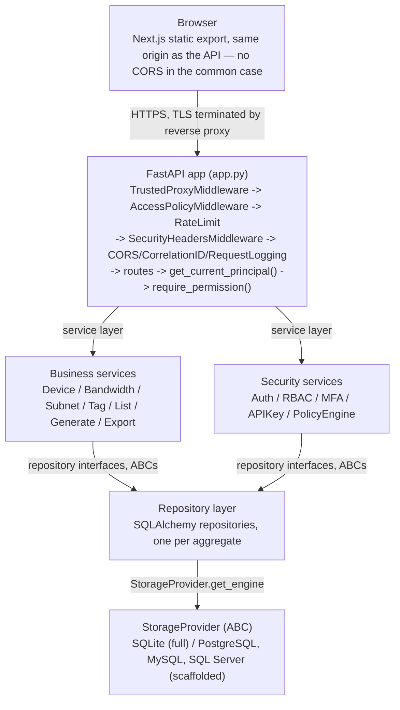
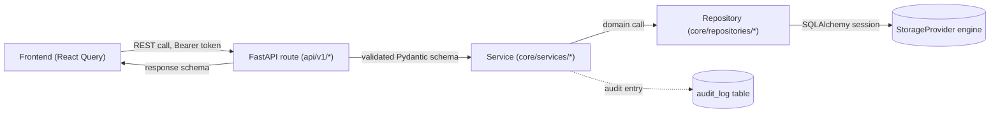

# Architecture Overview

See also [[Repository Overview]] for the project-level summary this page expands on, and the individual diagram pages in [[Architecture/Diagrams/System Architecture|Architecture/Diagrams/]].

## Principles

These govern every design decision in the codebase (source: `docs/architecture.md`):

1. Core owns the inventory model.
2. Integrations are optional (see [[Integrations Documentation/Integrations Overview|Integrations Overview]]).
3. Core never imports integrations.
4. Zero required backend dependencies beyond what's vendored.
5. SQLite is the default storage; other databases are opt-in, never required.
6. Everything must work offline (see [[Deployment/Air-Gap Deployment|Air-Gap Deployment]]).
7. Explicit code is preferred over clever abstractions.
8. Simplicity is a feature — a smaller surface area is easier to audit.

## System architecture



Also see [[Architecture/Diagrams/System Architecture|System Architecture (standalone diagram)]].

## Frontend architecture

Next.js 14 App Router, built as a fully static export (`output: 'export'`) — no Node.js server process at runtime, no SSR. FastAPI's `StaticFiles` mount serves the export directly, so frontend and API share one origin/port/TLS cert, which is also what allows a same-origin-only Content-Security-Policy (see [[Security/Security Overview|Security Overview]]).

```
frontend/
  src/
    app/            App Router pages (route = folder)
    modules/         feature view components (DevicesView, GenerateView, ...)
    components/       shared UI primitives
    lib/               API client, auth context, theme
  out/               built static export (served by FastAPI) — generated, not committed
```

Full detail: [[Frontend Documentation/Frontend Overview|Frontend Overview]].

## Backend architecture

Strictly layered — see [[Backend/Backend Overview|Backend Overview]]:

- **Repositories** (`core/repositories/`) never contain business logic, only persistence.
- **Services** (`core/services/`) never import a database driver directly — only repository interfaces (ABCs) — so swapping SQLite for PostgreSQL touches zero service code.
- **Routes** (`api/v1/`) never contain business logic — validate input, call a service, shape the response.
- **Core never imports integrations.**

## API architecture

URL-based versioning: all endpoints under `/api/v1/`, router-per-version (`api/v1/` is a self-contained package), single FastAPI app with one shared OpenAPI document. See [[API Documentation/API Versioning|API Versioning]] and [[API Documentation/API Overview|API Overview]].

> [!NOTE]
> Loose files directly under `api/` (`api/devices.py`, `api/audit.py`, etc., sibling to the `api/v1/` package) predate the versioning scheme. `app.py` only mounts `api/v1/router.py`; confirm before treating the unversioned files as live routes — see [[Development/Technical Debt|Technical Debt]].

## Database architecture

`StorageProvider` ABC decouples every repository/service/route from any specific database driver. SQLite is fully implemented; PostgreSQL/MySQL/SQL Server are interface-complete scaffolds. See [[Database Overview]] and [[Architecture/Diagrams/Data Flow|Data Flow]].

## Authentication flow

```
Request
  -> Reverse Proxy (TLS termination)
  -> TrustedProxyMiddleware        resolve real client IP (X-Forwarded-For, only from trusted proxies)
  -> AccessPolicyMiddleware        IP allow/deny -- runs BEFORE authentication
  -> RateLimitMiddleware           per-IP throttling, stricter on /auth/login
  -> SecurityHeadersMiddleware     HSTS, CSP, X-Frame-Options, etc.
  -> CORS / CorrelationID / RequestLogging
  -> FastAPI route
  -> get_current_principal()       JWT or API key -> Principal
  -> require_permission("code")    RBAC check -- no hardcoded role names, ever
  -> Route handler
  -> AuditRepository.log(...)      every security-sensitive action recorded
```

Full detail: [[Security/Authentication|Authentication]].

## Authorization model

Permission-code based (`<resource>:<action>`, e.g. `inventory:write`), never a hardcoded role-name check. Five system roles seeded by default plus unlimited custom roles. See [[Security/Authorization & RBAC|Authorization & RBAC]].

## Data flow



See also [[Architecture/Diagrams/Data Flow|Data Flow (standalone diagram)]].

## Request lifecycle

1. Reverse proxy terminates TLS, forwards to ConfigFoundry.
2. `TrustedProxyMiddleware` resolves the real client IP from `X-Forwarded-For`, trusted only from configured proxy CIDRs (`CONFIGFOUNDRY_AUTH_TRUSTED_PROXIES`).
3. `AccessPolicyMiddleware` evaluates IP allow/deny rules — before authentication, so a denied IP never reaches `/auth/login`.
4. `RateLimitMiddleware` throttles per-IP, stricter on `/auth/login` and `/auth/mfa/*`.
5. `SecurityHeadersMiddleware` sets CSP, HSTS, X-Frame-Options on every response.
6. The route handler runs: `get_current_principal()` resolves a JWT or API key, `require_permission("resource:action")` checks the grant.
7. The handler calls a service, which calls a repository, which goes through `StorageProvider.get_engine()`.
8. Security-sensitive and business-mutating actions are recorded via `AuditRepository.log(...)`.

Middleware is registered in `app.py` in the *reverse* of execution order (Starlette convention: last-added runs first).

## Background jobs

None exist. There is no task queue, scheduler, or worker process — ConfigFoundry is a single synchronous-per-request FastAPI process. Config generation (`POST /api/v1/generate`) runs inline within the request and returns the result directly; nothing is deferred. See [[Development/Technical Debt|Technical Debt]] for the absence of async job infrastructure as a scalability gap (tracked toward v0.8.x in [[Roadmap Overview]]).

## Caching

No application-level caching layer exists (no Redis, no in-process cache for query results). Rate limiting state is the one in-memory, per-process structure (`core/security/rate_limit.py`) — see [[Security/Security Overview#Rate limiting|Security Overview § Rate limiting]] for why this doesn't scale across multiple instances yet.

## Error handling

A single global exception handler in `app.py` catches unhandled exceptions, logs the full traceback server-side (with correlation ID), and returns a sanitized JSON body (`{"error": "...", "type": "..."}`) to the client — never a stack trace. FastAPI's own validation (Pydantic schema errors) returns the standard `422` shape. See [[API Documentation/API Overview#Conventions|API Overview § Conventions]] for the status code table.

## Logging

Structured logging framework under `core/logging/` — a single `configfoundry` root logger, correlation-ID propagation via `contextvars`, text or JSON output, size/daily rotation. See [[Backend/Logging Framework|Logging Framework]].

## Monitoring

No dedicated `/health` or `/metrics` endpoint yet (tracked in [[Roadmap Overview]] for v0.6.0) — `GET /openapi.json` and `GET /api/v1/meta` are used as liveness/readiness substitutes today. See [[Operations/Runbook - Monitoring & Health Checks|Runbook - Monitoring & Health Checks]].

## Diagrams

- [[Architecture/Diagrams/System Architecture|System Architecture]]
- [[Architecture/Diagrams/Request Flow|Request Flow]]
- [[Architecture/Diagrams/Component Relationships|Component Relationships]]
- [[Architecture/Diagrams/Deployment Diagram|Deployment Diagram]]
- [[Architecture/Diagrams/Data Flow|Data Flow]]
- [[Architecture/Diagrams/User Journey|User Journey]]

## See also

[[Backend/Backend Overview|Backend Overview]] · [[Frontend Documentation/Frontend Overview|Frontend Overview]] · [[Database Overview]] · [[Security/Security Overview|Security Overview]] · [[API Documentation/API Overview|API Overview]] · [[Architecture/Decisions/ADR Index|ADR Index]]
