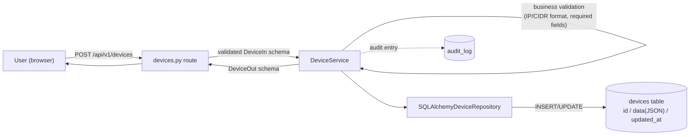
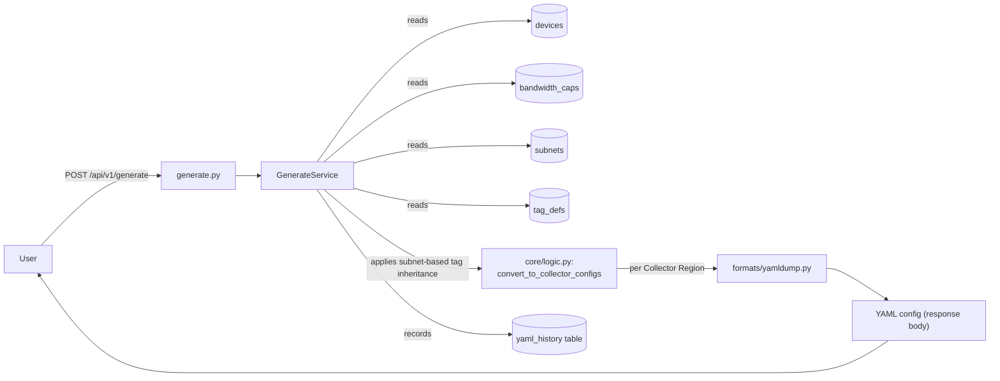
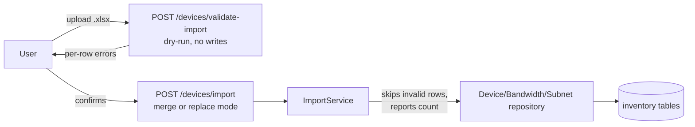

# Data Flow

Parent: [[Architecture Overview]]

## Inventory write path

## Config generation path

`POST /api/v1/generate` never writes the generated YAML to disk — it returns it in the response and records that a generation happened (with actor and timestamp) in `history`, so config drift stays reviewable via `GET /api/v1/history`. See [[Features/Feature - YAML Config Generation|Feature - YAML Config Generation]].

## Excel import path

