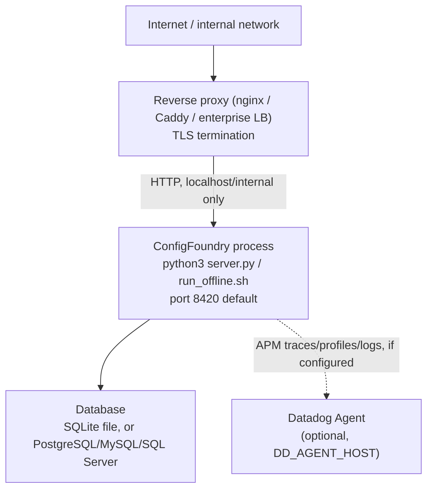

# Deployment Diagram

Parent: [[Architecture Overview]] · [[Deployment/Deployment Overview|Deployment Overview]]

Single-process topology: one ConfigFoundry instance per team/environment, no built-in load balancer, message queue, or worker pool. Multi-instance is possible only with a shared PostgreSQL backend and is not validated end-to-end for SQLite. See [[Deployment/Production Deployment|Production Deployment]] and [[Deployment/Deployment Overview#Zero-downtime notes|Deployment Overview § Zero-downtime notes]].

There is no Dockerfile or container image in this repository today — deployment is a bare-metal/VM process under a supervisor (systemd example in [[Deployment/Production Deployment|Production Deployment]]). See [[Development/Technical Debt|Technical Debt]].
