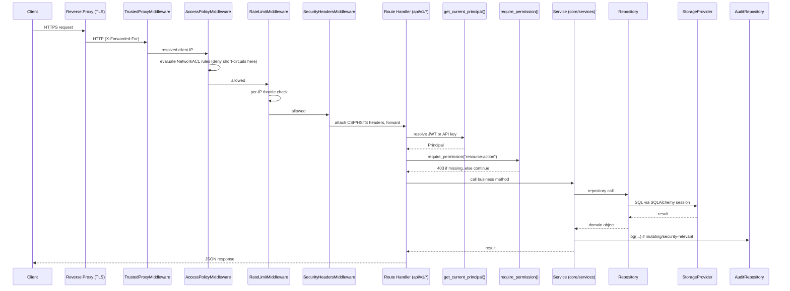

# Request Flow

Parent: [[Architecture Overview]]

```mermaid
sequenceDiagram
    participant C as Client
    participant P as Reverse Proxy (TLS)
    participant TP as TrustedProxyMiddleware
    participant AP as AccessPolicyMiddleware
    participant RL as RateLimitMiddleware
    participant SH as SecurityHeadersMiddleware
    participant R as Route Handler (api/v1/*)
    participant Auth as get_current_principal()
    participant Perm as require_permission()
    participant Svc as Service (core/services)
    participant Repo as Repository
    participant DB as StorageProvider
    participant Aud as AuditRepository

    C->>P: HTTPS request
    P->>TP: HTTP (X-Forwarded-For)
    TP->>AP: resolved client IP
    AP->>AP: evaluate NetworkACL rules (deny short-circuits here)
    AP->>RL: allowed
    RL->>RL: per-IP throttle check
    RL->>SH: allowed
    SH->>R: attach CSP/HSTS headers, forward
    R->>Auth: resolve JWT or API key
    Auth-->>R: Principal
    R->>Perm: require_permission("resource:action")
    Perm-->>R: 403 if missing, else continue
    R->>Svc: call business method
    Svc->>Repo: repository call
    Repo->>DB: SQL via SQLAlchemy session
    DB-->>Repo: result
    Repo-->>Svc: domain object
    Svc->>Aud: log(...) if mutating/security-relevant
    Svc-->>R: result
    R-->>C: JSON response
```

See [[Security/Authentication|Authentication]] and [[Architecture Overview#Request lifecycle]] for the prose walkthrough.
