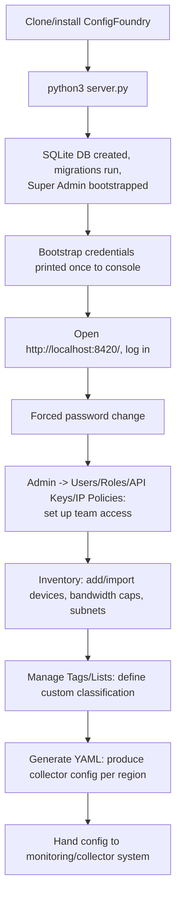
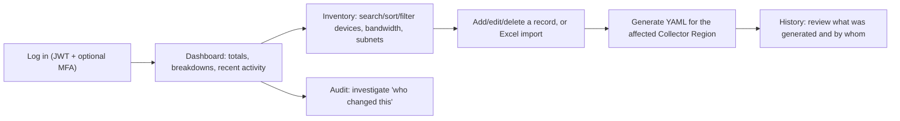

# User Journey

Parent: [[Architecture Overview]] · [[Product/Target Users & Use Cases|Target Users & Use Cases]]

## First run (operator bootstrapping an instance)

## Day-to-day operator flow

See [[Product/Target Users & Use Cases|Target Users & Use Cases]] for the personas behind this journey and [[Features/Feature - Dashboard|Feature - Dashboard]] / [[Features/Feature - Inventory Management|Feature - Inventory Management]] for the underlying features.
