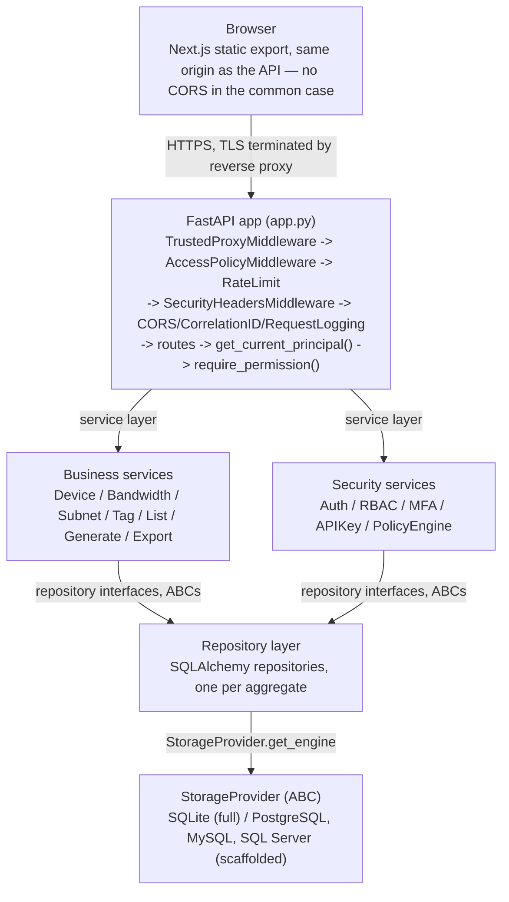
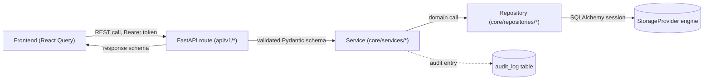

# Architecture Overview

See also [Repository Overview](../reference/Repository Overview.md) for the project-level summary this page expands on, and the individual diagram pages in [Architecture/Diagrams/](System Architecture.md).

## Principles

These govern every design decision in the codebase (source: `docs/architecture.md`):

1. Core owns the inventory model.
2. Integrations are optional (see [Integrations Overview](../integrations/Integrations Overview.md)).
3. Core never imports integrations.
4. Zero required backend dependencies beyond what's vendored.
5. SQLite is the default storage; other databases are opt-in, never required.
6. Everything must work offline (see [Air-Gap Deployment](../deployment/Air-Gap Deployment.md)).
7. Explicit code is preferred over clever abstractions.
8. Simplicity is a feature — a smaller surface area is easier to audit.
9. ConfigFoundry is a vendor-neutral Monitoring Configuration Platform, not a Datadog configuration generator. Datadog is the first supported monitoring platform, not a special one. Adding a new monitoring platform requires only a new Platform Adapter package plus one line in the Platform Registry — never a change to Inventory, Validation, the API contract, or another platform's code (see [ADR-0008](../adr/ADR-0008 - Platform Adapter Architecture.md)).

## System architecture



Also see [System Architecture (standalone diagram)](System Architecture.md).

## Frontend architecture

Next.js 14 App Router, built as a fully static export (`output: 'export'`) — no Node.js server process at runtime, no SSR. FastAPI's `StaticFiles` mount serves the export directly, so frontend and API share one origin/port/TLS cert, which is also what allows a same-origin-only Content-Security-Policy (see [Security Overview](../security/Security Overview.md)).

```
frontend/
  src/
    app/            App Router pages (route = folder)
    modules/         feature view components (DevicesView, PlatformsView, GenerateView, ...)
    components/       shared UI primitives
    lib/               API client, auth context, theme
  out/               built static export (served by FastAPI) — generated, not committed
```

Full detail: [Frontend Overview](Frontend Overview.md).

## Backend architecture

Strictly layered — see [Backend Overview](Backend Overview.md):

- **Repositories** (`core/repositories/`) never contain business logic, only persistence.
- **Services** (`core/services/`) never import a database driver directly — only repository interfaces (ABCs) — so swapping SQLite for PostgreSQL touches zero service code.
- **Routes** (`api/v1/`) never contain business logic — validate input, call a service, shape the response.
- **Core never imports integrations.**

## API architecture

URL-based versioning: all endpoints under `/api/v1/`, router-per-version (`api/v1/` is a self-contained package), single FastAPI app with one shared OpenAPI document. See [API Versioning](../api/API Versioning.md) and [API Overview](../api/API Overview.md).

> [!NOTE]
> Loose files directly under `api/` (`api/devices.py`, `api/audit.py`, etc., sibling to the `api/v1/` package) predate the versioning scheme. `app.py` only mounts `api/v1/router.py`; confirm before treating the unversioned files as live routes — see [Technical Debt](../development/Technical Debt.md).

## Monitoring Platform architecture

Config generation follows a fixed, one-directional pipeline (ADR-0008):

```mermaid
flowchart LR
    Inventory["Inventory<br/>devices / bandwidth / subnets / tags (core/repositories/*)"]
    Validation["Validation<br/>core/validator.py — vendor-neutral rule engine"]
    Canonical["MonitoringConfiguration<br/>core/domain/ — canonical, immutable, vendor-neutral"]
    Adapter["Platform Adapter<br/>core/platforms/&lt;platform&gt;/adapter.py"]
    Model["Platform Model<br/>core/platforms/&lt;platform&gt;/models.py — vendor-specific shape"]
    Renderer["Renderer<br/>core/platforms/rendering/ — text/bytes"]
    Output["Output<br/>YAML / JSON / XML / REST API"]

    Inventory --> Validation --> Canonical --> Adapter --> Model --> Renderer --> Output
```



- **Inventory** and **Validation** (`core/domain/`, `core/validator.py`) never contain a monitoring-platform concept. They know about network-equipment vendors (e.g. Arista's `Eth N` interface naming) but never about Datadog, Prometheus, or any output format.
- **`MonitoringConfiguration`** (`core/domain/models.py`) is the canonical, immutable root object — devices, credentials, validation results, plus reserved extension points (templates, variables, profiles, metadata) for capability that doesn't exist yet. Platform Adapters read it; they never mutate it.
- **Platform Adapter** (`core/platforms/base.py::PlatformAdapter`) is the only place vendor-specific logic is allowed to live. Each platform owns its own package (`core/platforms/datadog/`, `.../prometheus/`, `.../zabbix/`) containing its adapter, mapper, platform model, and renderer. Only `generate()` is implemented today; `validate()` / `deploy()` / `verify()` / `import_config()` / `rollback()` are part of the interface for forward compatibility and return a structured "not implemented" `CapabilityResult` until a platform implements them.
- **Platform Registry** (`core/platforms/registry.py`) is the single wiring point. `GET /api/v1/platforms` reads it directly — the frontend's Monitoring Platforms hub (`/configuration/generate`) renders one card per registry entry, so adding a platform to the registry is enough to make it appear in the UI.
- **Mapping is separated from rendering** on purpose: a Platform Adapter maps `MonitoringConfiguration` into its own Platform Model (still structured data, still vendor-specific), then a Renderer turns that into final output text. This means a future deployment API, or an alternate output format for the same platform, is a new renderer — not a change to the mapping logic.

See [ADR-0008](../adr/ADR-0008 - Platform Adapter Architecture.md) for the full rationale, including the backward-compatibility proof (Datadog output is byte-for-byte identical to the pre-refactor implementation, verified by `tests/platforms/test_datadog_regression.py`).

## Database architecture

`StorageProvider` ABC decouples every repository/service/route from any specific database driver. SQLite is fully implemented; PostgreSQL/MySQL/SQL Server are interface-complete scaffolds. See [Database Overview](Database Overview.md) and [Data Flow](Data Flow.md).

## Authentication flow

```
Request
  -> Reverse Proxy (TLS termination)
  -> TrustedProxyMiddleware        resolve real client IP (X-Forwarded-For, only from trusted proxies)
  -> AccessPolicyMiddleware        IP allow/deny -- runs BEFORE authentication
  -> RateLimitMiddleware           per-IP throttling, stricter on /auth/login
  -> SecurityHeadersMiddleware     HSTS, CSP, X-Frame-Options, etc.
  -> CORS / CorrelationID / RequestLogging
  -> FastAPI route
  -> get_current_principal()       JWT or API key -> Principal
  -> require_permission("code")    RBAC check -- no hardcoded role names, ever
  -> Route handler
  -> AuditRepository.log(...)      every security-sensitive action recorded
```

Full detail: [Authentication](../security/Authentication Overview.md).

## Authorization model

Permission-code based (`<resource>:<action>`, e.g. `inventory:write`), never a hardcoded role-name check. Five system roles seeded by default plus unlimited custom roles. See [Authorization & RBAC](../security/Authorization & RBAC.md).

## Data flow



See also [Data Flow (standalone diagram)](Data Flow.md).

## Request lifecycle

1. Reverse proxy terminates TLS, forwards to ConfigFoundry.
2. `TrustedProxyMiddleware` resolves the real client IP from `X-Forwarded-For`, trusted only from configured proxy CIDRs (`CONFIGFOUNDRY_AUTH_TRUSTED_PROXIES`).
3. `AccessPolicyMiddleware` evaluates IP allow/deny rules — before authentication, so a denied IP never reaches `/auth/login`.
4. `RateLimitMiddleware` throttles per-IP, stricter on `/auth/login` and `/auth/mfa/*`.
5. `SecurityHeadersMiddleware` sets CSP, HSTS, X-Frame-Options on every response.
6. The route handler runs: `get_current_principal()` resolves a JWT or API key, `require_permission("resource:action")` checks the grant.
7. The handler calls a service, which calls a repository, which goes through `StorageProvider.get_engine()`.
8. Security-sensitive and business-mutating actions are recorded via `AuditRepository.log(...)`.

Middleware is registered in `app.py` in the *reverse* of execution order (Starlette convention: last-added runs first).

## Background jobs

None exist. There is no task queue, scheduler, or worker process — ConfigFoundry is a single synchronous-per-request FastAPI process. Config generation (`POST /api/v1/generate`) runs inline within the request and returns the result directly; nothing is deferred. See [Technical Debt](../development/Technical Debt.md) for the absence of async job infrastructure as a scalability gap (tracked toward v0.8.x in [Roadmap Overview](../roadmap/Roadmap Overview.md)).

## Caching

No application-level caching layer exists (no Redis, no in-process cache for query results). Rate limiting state is the one in-memory, per-process structure (`core/security/rate_limit.py`) — see [Security Overview § Rate limiting](../security/Security Overview.md#rate-limiting) for why this doesn't scale across multiple instances yet.

## Error handling

A single global exception handler in `app.py` catches unhandled exceptions, logs the full traceback server-side (with correlation ID), and returns a sanitized JSON body (`{"error": "...", "type": "..."}`) to the client — never a stack trace. FastAPI's own validation (Pydantic schema errors) returns the standard `422` shape. See [API Overview § Conventions](../api/API Overview.md#conventions) for the status code table.

## Logging

Structured logging framework under `core/logging/` — a single `configfoundry` root logger, correlation-ID propagation via `contextvars`, text or JSON output, size/daily rotation. See [Logging Framework](Logging Framework.md).

## Monitoring

No dedicated `/health` or `/metrics` endpoint yet (tracked in [Roadmap Overview](../roadmap/Roadmap Overview.md) for v0.6.0) — `GET /openapi.json` and `GET /api/v1/meta` are used as liveness/readiness substitutes today. See [Runbook - Monitoring & Health Checks](../deployment/runbooks/Runbook - Monitoring & Health Checks.md).

## Diagrams

- [System Architecture](System Architecture.md)
- [Request Flow](Request Flow.md)
- [Component Relationships](Component Relationships.md)
- [Deployment Diagram](Deployment Diagram.md)
- [Data Flow](Data Flow.md)
- [User Journey](User Journey.md)

## See also

[Backend Overview](Backend Overview.md) · [Frontend Overview](Frontend Overview.md) · [Database Overview](Database Overview.md) · [Security Overview](../security/Security Overview.md) · [API Overview](../api/API Overview.md) · [ADR Index](../adr/ADR Index.md)
