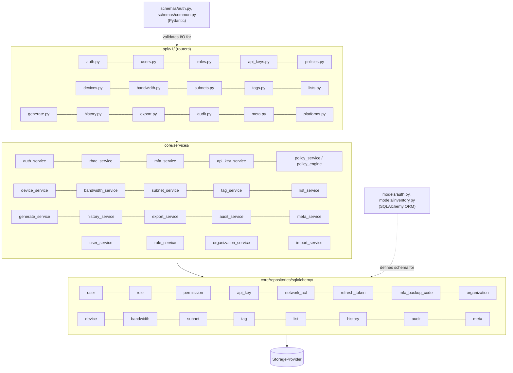

# Component Relationships

Parent: [Architecture Overview](Architecture Overview.md)

Core dependency rule (see [Architecture Overview](Architecture Overview.md#principles)): `api/` depends on `core/`; `core/` never depends on `api/`, `integrations/`, or `frontend/`. See [Backend Overview](Backend Overview.md) for what lives in each `core/` subpackage.
