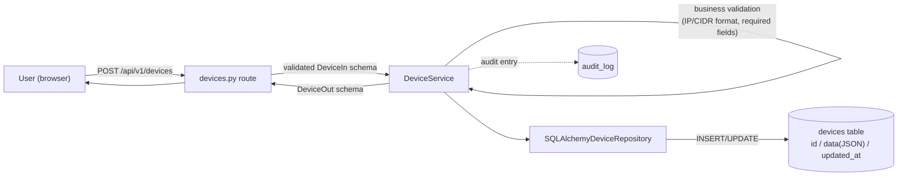
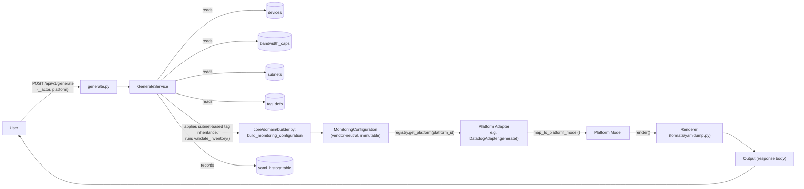
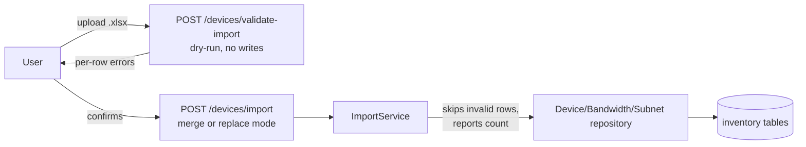

# Data Flow

Parent: [Architecture Overview](Architecture Overview.md)

## Inventory write path

## Config generation path

Vendor-neutral through `MonitoringConfiguration`; only the last two steps are platform-specific (ADR-0008):

`POST /api/v1/generate` never writes the generated output to disk — it returns it in the response and records that a generation happened (with actor, timestamp, and platform id) in `history`, so config drift stays reviewable via `GET /api/v1/history`. `GET /api/v1/platforms` reads the Platform Registry directly (no request body, no DB read) to list available platforms for the frontend's Monitoring Platforms hub. See [Feature - YAML Config Generation](../reference/features/Feature - YAML Config Generation.md) and [ADR-0008](../adr/ADR-0008 - Platform Adapter Architecture.md).

## Excel import path

