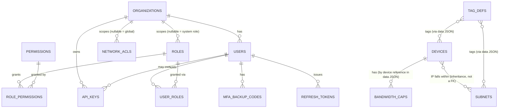
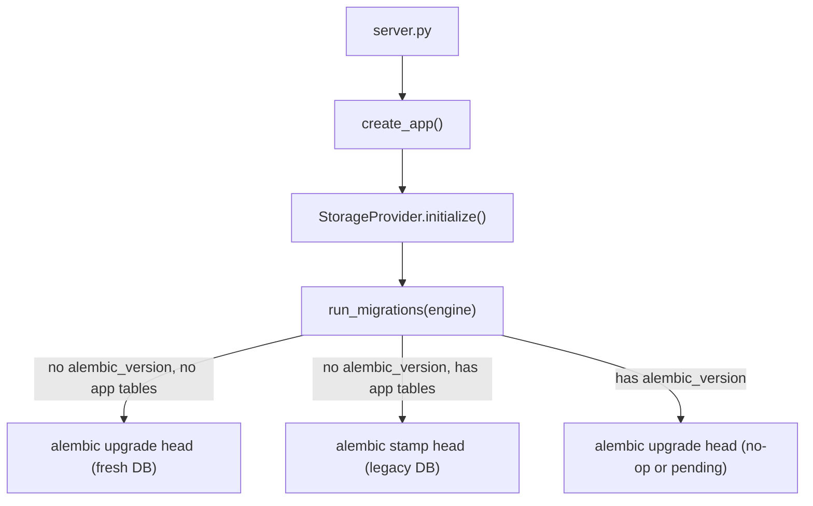

# Database Overview

Parent: [Repository Overview](../reference/Repository Overview.md) · [Architecture Overview](Architecture Overview.md) · [Storage Abstraction](Storage Abstraction.md)

Covers `db/` (runtime SQLite file location) and `alembic/` (migrations), plus the schema defined in `models/`.

## Providers

| Provider | Status | Driver |
|---|---|---|
| SQLite | Fully functional, default | Built into Python |
| PostgreSQL | Scaffolded, not production-validated | `psycopg2` (not vendored by default) |
| MySQL | Scaffolded | `pymysql` / `mysqlclient` |
| SQL Server | Scaffolded | `pyodbc` |

SQLite is default per the "zero required backend dependencies" architecture principle. See [Storage Abstraction](Storage Abstraction.md) for the `StorageProvider` mechanics.

## Tables

### Inventory (JSON-blob entity tables — `id` / `data` / `updated_at`)

| Table | Model | Notes |
|---|---|---|
| `devices` | `DeviceModel` | Device inventory row; fields live inside the `data` JSON blob, not as columns |
| `bandwidth_caps` | `BandwidthCapModel` | Bandwidth cap per device/interface |
| `subnets` | `SubnetModel` | Subnet/CIDR definitions, used for tag inheritance |
| `tag_defs` | `TagDefModel` | Dynamic tag definitions |
| `lists` | `ListModel` | `list_name` (PK) / `items` — managed dropdown value lists (Collector Region, tag values) |
| `meta` | `MetaModel` | `key` (PK) / `value` — key-value metadata store |
| `audit_log` | `AuditLogModel` | Business + security audit trail (see below) |
| `yaml_history` | `YamlHistoryModel` | Record of every YAML generation: `id`, `ts`, `actor`, `summary`, `files` |

### Security / RBAC (normalized relational tables)

| Table | Model | Notes |
|---|---|---|
| `organizations` | `OrganizationModel` | Multi-tenant root |
| `users` | `UserModel` | Argon2id `hashed_password`, `perm_version` (session invalidation stamp), MFA fields, lockout fields |
| `roles` | `RoleModel` | `is_system` flags the 5 seeded roles |
| `permissions` | `PermissionModel` | Flat catalog of `<resource>:<action>` codes |
| `role_permissions` | `RolePermissionModel` | Role <-> Permission, many-to-many |
| `user_roles` | `UserRoleModel` | User <-> Role, scoped per organization |
| `refresh_tokens` | `RefreshTokenModel` | Hashed, rotate-on-use, `family_id` for reuse detection |
| `api_keys` | `APIKeyModel` | Hashed, scoped (permissions + IP allowlist, both JSON-encoded text columns) |
| `network_acls` | `NetworkACLModel` | Access Policy Engine allow/deny CIDR rules |
| `mfa_backup_codes` | `MFABackupCodeModel` | One-time TOTP recovery codes, hashed |

`audit_log` is shared by both inventory and security events — the table was **extended with nullable columns** (`org_id`, `source_ip`, `user_agent`, `resource_type`, `resource_id`, `result`, `correlation_id`) rather than duplicated, so every pre-existing call site kept working unchanged.

## Relationships

> [!NOTE]
> The inventory tables (`devices`, `bandwidth_caps`, `subnets`, `tag_defs`) do not use SQL foreign keys between each other — relationships (device-to-subnet by IP/CIDR containment, tag-to-record) are resolved in application code from the JSON `data` blob, not enforced at the schema level. This is a deliberate simplicity trade-off from the original design, inherited unchanged by the SQLAlchemy migration. See [Database Overview](Database Overview.md#future-schema-improvements).

## Indexes

Explicit indexes exist on the security/RBAC tables: `organizations.slug` (unique), `users.email` (unique), `users.username` (unique), `users.org_id`, `roles.org_id`, `permissions.code` (unique), `refresh_tokens.user_id`, `refresh_tokens.token_hash` (unique), `refresh_tokens.family_id`, `api_keys.org_id`, `api_keys.key_prefix`, `api_keys.key_hash` (unique), `network_acls.org_id`, `mfa_backup_codes.user_id`. The JSON-blob inventory tables have only their primary key (`id`) indexed — no index on `data` contents, since it's a JSON blob scanned in Python rather than queried in SQL.

## Migration strategy

[Alembic](https://alembic.sqlalchemy.org/), applied automatically at startup via `core/migrations/runner.py`:

Migration history: `0001_baseline_schema.py` (the 8 original inventory tables) -> `0002_auth_and_security.py` (full auth/RBAC/policy schema + seeds system roles and the permission catalog).

Rules (see [Engineering Wiki](../development/Engineering Wiki.md) for the full developer-facing version): never edit a shipped migration file; always use `op.batch_alter_table()` for changes to existing tables (SQLite doesn't support most `ALTER TABLE` forms directly); use SQLAlchemy column types, not dialect-specific SQL, unless gated on `bind.dialect.name`; commit the migration file alongside the model change in the same PR; test both `upgrade()` and `downgrade()`.

## Future schema improvements

- **Multi-tenant inventory scoping** — retrofit `org_id` onto `devices`/`bandwidth_caps`/`subnets`/`tag_defs`/`lists`/`yaml_history`, which are currently implicitly single-tenant even though the security layer around them is fully organization-scoped. Flagged as the largest single migration on the roadmap (v0.7.0) — see [Roadmap Overview](../roadmap/Roadmap Overview.md) and [Security Overview § Known scope boundaries](../security/Security Overview.md#known-scope-boundaries).
- **Real foreign keys / normalized columns** for the inventory tables, instead of JSON blobs scanned in Python — would enable SQL-level filtering/joins and referential integrity between devices and subnets, at the cost of a larger migration touching every inventory repository.
- **Connection URL validation** on `DatabaseConfig` before `initialize()` is called.
- **Audit log retention/export tooling** — nothing is auto-purged today (deliberate default); planned for v0.7.0.

## ER diagram

See the Mermaid diagram above, or [Data Flow](Data Flow.md) for how data moves through these tables at request time.

## Backups

- **SQLite (default):** back up `db/configfoundry.db` directly — a plain file copy is valid only when no write is in progress; use `sqlite3 .backup` or briefly stop the process for a live server. `upgrade_offline.sh` does this automatically before an upgrade.
- **PostgreSQL/MySQL/SQL Server:** use standard tooling (`pg_dump`, `mysqldump`) — ConfigFoundry does not wrap or replace these.

See [Runbook - Backup & Recovery](../deployment/runbooks/Runbook - Backup & Recovery.md).

## See also

[Storage Abstraction](Storage Abstraction.md) · [Security Overview](../security/Security Overview.md) · [Engineering Wiki](../development/Engineering Wiki.md) · [Runbook - Backup & Recovery](../deployment/runbooks/Runbook - Backup & Recovery.md)
