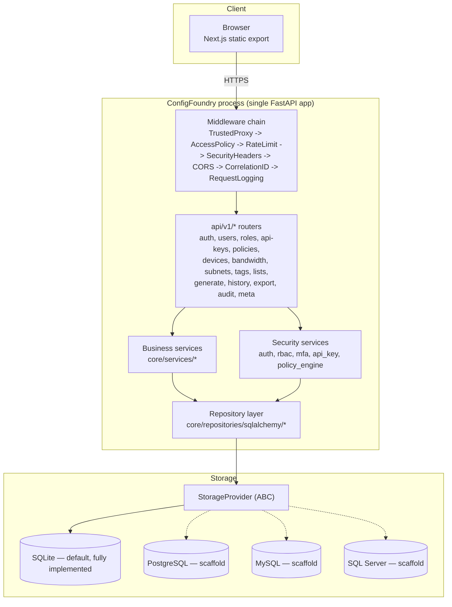

# System Architecture

Parent: [Architecture Overview](Architecture Overview.md)

See [Database Overview](Database Overview.md) for the storage provider detail and [Security Overview](../security/Security Overview.md) for the security services.
