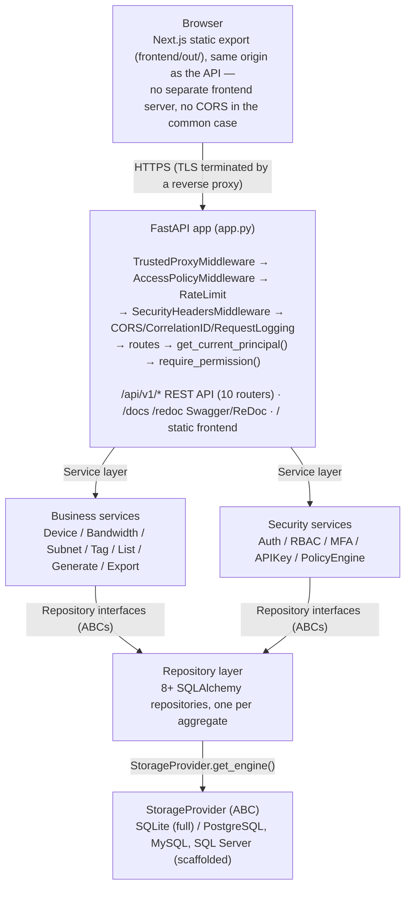

# Architecture

## Principles

These have governed every design decision in ConfigFoundry, including
the security, storage, and air-gap work layered on top of the original
inventory core:

1. Core owns the inventory model.
2. Integrations are optional.
3. Core never imports integrations.
4. Zero required backend dependencies beyond what's vendored.
5. SQLite is the default storage; other databases are opt-in, never required.
6. Everything must work offline (see [Air-Gap Deployment](../deployment/airgap.md)).
7. Explicit code is preferred over clever abstractions.
8. Simplicity is a feature — a smaller surface area is easier to audit,
   which matters in the regulated environments this targets.

For where these principles are headed next, see [Roadmap](../roadmap/roadmap.md).

## System overview



## Request lifecycle

1. Reverse proxy terminates TLS, forwards to ConfigFoundry.
2. `TrustedProxyMiddleware` resolves the real client IP from
   `X-Forwarded-For`, trusting it only from configured proxy CIDRs
   (`CONFIGFOUNDRY_AUTH_TRUSTED_PROXIES`).
3. `AccessPolicyMiddleware` evaluates IP allow/deny rules — runs before
   authentication, since a denied IP shouldn't even reach the login
   endpoint.
4. `RateLimitMiddleware` throttles per-IP, stricter on `/auth/login`.
5. `SecurityHeadersMiddleware` sets CSP, HSTS, X-Frame-Options, etc. on
   every response.
6. The route handler runs. Protected routes depend on
   `get_current_principal()` (resolves a JWT or API key into a
   `Principal`, via `Security(HTTPBearer(...))` so it's visible in the
   OpenAPI schema) and `require_permission("resource:action")` (checks
   the principal's role grants — see [RBAC](../security/rbac.md)).
7. The handler calls into a service, which calls a repository, which
   goes through `StorageProvider.get_engine()`.
8. Security-sensitive and business-mutating actions are recorded via
   `AuditRepository.log(...)`.

Full detail on this pipeline, including exact middleware registration
order and why it's the reverse of execution order, is in
[Authentication](../security/authentication.md).

## Layering rules

- **Repositories** never contain business logic — only persistence.
- **Services** never import a database driver directly — only repository
  interfaces (ABCs), so swapping SQLite for PostgreSQL touches zero
  service code.
- **Routes** never contain business logic — they validate input,
  call a service, and shape the response.
- **Core never imports integrations** — the inventory/generation core
  has no knowledge of any specific external system; integrations (if
  added later) depend on core, never the reverse.

## Key subsystems, with their own detailed docs

- **[Storage](storage.md)** — the `StorageProvider` abstraction, why
  it exists, and how to add a new backend.
- **[Migrations](migrations.md)** — Alembic-based schema evolution,
  applied automatically at startup.
- **[Authentication](../security/authentication.md)** / **[Authorization](../security/authorization.md)**
  / **[RBAC](../security/rbac.md)** — the full security layer: JWT + refresh
  rotation, MFA, API keys, permission-code-based access control, the
  Access Policy Engine.
- **[Logging](logging.md)** — the `core/logging/` framework: structured
  JSON or text, correlation IDs, request logging middleware.
- **[API Versioning](../api/api-versioning.md)** — router-per-version design,
  how `/api/v2/` would be added without touching `/api/v1/`.
- **[Air-Gap Deployment](../deployment/airgap.md)** — why every dependency is
  vendored and every asset self-hosted, and what enforces it.

## Frontend architecture

Next.js 14 (App Router), built as a fully static export
(`output: 'export'`) — no Node.js server process at runtime, no
server-side rendering. The static export is served directly by FastAPI's
`StaticFiles` mount, so the frontend and API share one origin, one port,
and one TLS certificate. This also means the CSP can be same-origin only
(`default-src 'self'`) with no CDN allowlisting required — see
[Security](../security/security.md).

```
frontend/
  src/
    app/            App Router pages (route = folder)
    components/      shared UI components
    lib/              API client, auth context, theme
  out/               built static export (served by FastAPI)
```

The one deliberate exception to `'unsafe-inline'`-free CSP is
`script-src`: Next.js's App Router embeds hydration data in an inline
`<script>` tag, which requires `'unsafe-inline'` regardless of static
export mode. All other directives remain strictly same-origin.

## Configuration generation pipeline

`POST /api/v1/generate` reads the current inventory (devices, bandwidth
caps, subnets, tags) through the service layer, applies the collector
YAML template, and writes a `history` entry recording the generated
output alongside who generated it and when — so config drift is always
attributable and reviewable via `GET /api/v1/history`.

## Diagram source

Diagrams on this page are [Mermaid](https://mermaid.js.org/) fenced code
blocks (` ```mermaid `), rendered client-side by a small, self-hosted
Mermaid bundle in the in-app documentation viewer — no CDN dependency,
consistent with the air-gap requirement that everything in `docs/` works
with zero network access (see [Air-Gap Deployment](../deployment/airgap.md)). GitHub
also renders these natively, and any plain-text reader still shows
readable diagram source even without rendering support.
