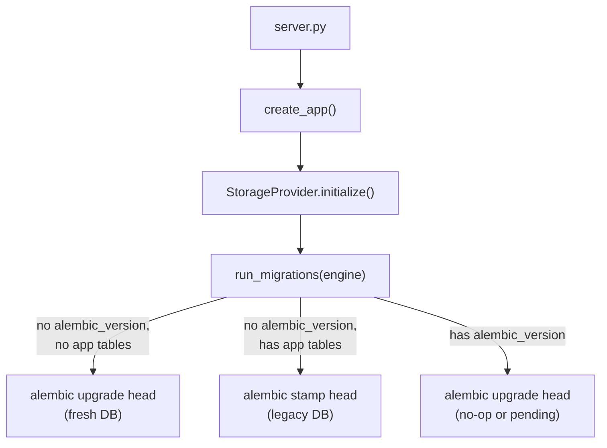

# Migrations

Schema changes are managed with [Alembic](https://alembic.sqlalchemy.org/),
applied automatically at startup. This page is the quick-reference
summary; the full guide — module layout, every CLI command, and the
step-by-step process for writing a new migration — is
[Database Migrations](database-migrations.md).

## How it works, in short



> [!TIP]
> Startup is always safe to run: if the database is already current,
> `upgrade head` is a no-op. If new migrations shipped with a new
> release, they apply automatically before the server starts serving
> requests — this is also what `upgrade_offline.sh` relies on (see
> [Upgrade Guide](../deployment/upgrade.md) and [Air-Gap Deployment](../deployment/airgap.md)).

## Common commands

```bash
export CONFIGFOUNDRY_DB_URL=sqlite:///db/configfoundry.db   # or a postgresql+psycopg2://... URL

alembic current                        # what revision is this DB at
alembic history --indicate-current     # full history
alembic upgrade head                   # apply pending migrations manually
alembic downgrade -1                   # roll back one migration
alembic upgrade head --sql             # preview DDL without executing (for DBA review)
```

## Writing a new migration

1. Edit the ORM model in `models/`.
2. `alembic revision --autogenerate -m "describe the change"`.
3. Review the generated file in `alembic/versions/` carefully —
   autogenerate can miss check constraints and some index types.
4. Test both `upgrade()` and `downgrade()` against a copy of production
   data before merging.

> [!WARNING]
> Never modify a migration file after it has shipped in a release —
> write a new one instead, even to fix a mistake in an earlier one.

Full walkthrough with example diffs: [Database Migrations](database-migrations.md#adding-a-new-migration).

## Migration history

- `0001_baseline_schema.py` — creates the 8 original inventory tables.
- `0002_auth_and_security.py` — adds the full auth/RBAC/policy schema
  (users, roles, permissions, api_keys, network_acls, refresh_tokens,
  mfa_backup_codes) and seeds the system roles and permission catalog
  documented in [RBAC](../security/rbac.md).

## Air-gapped environments

Alembic itself has no network dependency — migrations run identically
with or without internet access, since they only touch the local
database file/connection. No special handling is needed beyond the
normal offline install described in [Air-Gap Deployment](../deployment/airgap.md).
