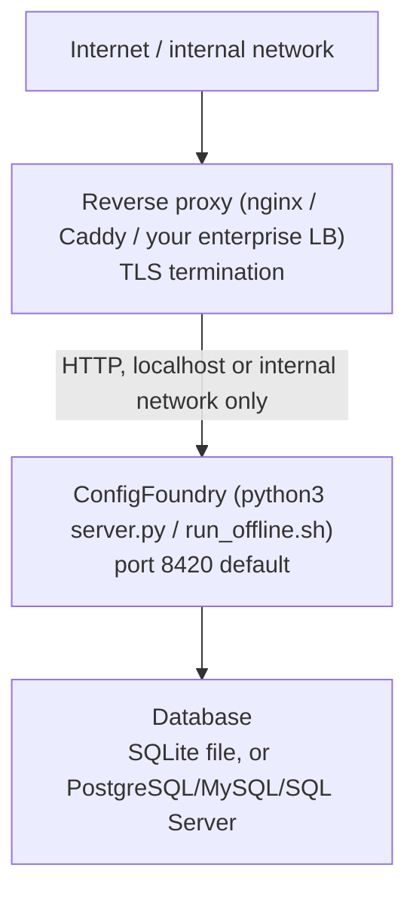

# Deployment

This page covers running ConfigFoundry in production, on a single
always-on machine. For deployment with zero internet access, see
[Air-Gap Deployment](./airgap.md) first — the two guides complement each
other; this one covers topology and networking, that one covers offline
installation specifically.

## Topology

ConfigFoundry is a single process (FastAPI + the static frontend export
served from the same origin) backed by one database. There is no
built-in load balancer, message queue, or worker pool — the intended
deployment is one instance per team/environment, run behind a reverse
proxy for TLS termination:



## Reverse proxy

Terminate TLS at the proxy; ConfigFoundry itself serves plain HTTP. A
minimal nginx example:

```nginx
server {
    listen 443 ssl;
    server_name configfoundry.yourcompany.example;

    ssl_certificate     /etc/ssl/certs/configfoundry.crt;
    ssl_certificate_key /etc/ssl/private/configfoundry.key;

    location / {
        proxy_pass http://127.0.0.1:8420;
        proxy_set_header Host $host;
        proxy_set_header X-Forwarded-For $proxy_add_x_forwarded_for;
        proxy_set_header X-Forwarded-Proto $scheme;
    }
}
```

Then set `CONFIGFOUNDRY_AUTH_TRUSTED_PROXIES` to the proxy's IP/CIDR so
`X-Forwarded-For` is trusted only from that source — see
[Configuration](./configuration.md). `SecurityHeadersMiddleware` always
sends `Strict-Transport-Security`; it's inert over plain HTTP and takes
effect once TLS is terminated in front of it.

## Running as a service

Use your platform's standard process supervisor rather than a bare
foreground process. `systemd` example:

```ini
# /etc/systemd/system/configfoundry.service
[Unit]
Description=ConfigFoundry
After=network.target

[Service]
Type=simple
User=configfoundry
WorkingDirectory=/opt/configfoundry
Environment=CONFIGFOUNDRY_AUTH_JWT_SECRET=...
Environment=CONFIGFOUNDRY_AUTH_SECRET_ENC_KEY=...
ExecStart=/opt/configfoundry/.venv/bin/python3 server.py --no-browser
Restart=on-failure
RestartSec=5

[Install]
WantedBy=multi-user.target
```

```bash
sudo systemctl enable --now configfoundry
```

> [!TIP]
> Prefer an environment file (`EnvironmentFile=/etc/configfoundry/env`)
> over inline `Environment=` lines for secrets, with restrictive file
> permissions (`chmod 600`).

## Database choice at this stage

SQLite is fine for a single-instance deployment of any size a small-to-
mid-sized team would produce — it's the whole database in one file, easy
to back up, easy to reason about. Move to PostgreSQL when you need
concurrent write throughput beyond what SQLite's single-writer model
comfortably handles, or when your organization's operational standard
requires a managed database server regardless of load. See
[Storage](./storage.md) for how to switch.

## Zero-downtime notes

There is currently no rolling-restart / blue-green story built in —
this is a single-process app, and a restart briefly interrupts service
(migrations run automatically and are fast for incremental schema
changes). For most deployments — an internal tool used during business
hours — a few seconds of downtime during a planned restart is
acceptable; if it isn't for your environment, put a second instance
behind the reverse proxy pointed at the same PostgreSQL database and
drain traffic manually during upgrades.

> [!CAUTION]
> Multi-instance writes are not validated end-to-end against SQLite —
> use PostgreSQL if you go this route.

## Firewall / network requirements

- Inbound: reverse proxy → ConfigFoundry port (default `8420`), typically
  localhost-only or restricted to an internal network segment.
- Outbound: **none required at runtime** — see [Air-Gap Deployment](./airgap.md).
- Database: outbound to your database host/port if using PostgreSQL/MySQL/SQL Server.

## Next steps

- [Enterprise Deployment](./enterprise.md) — hardening checklist beyond the basics above.
- [Monitoring](./monitoring.md) — health checks and what to alert on.
- [Security](./security.md) — the full security model.
