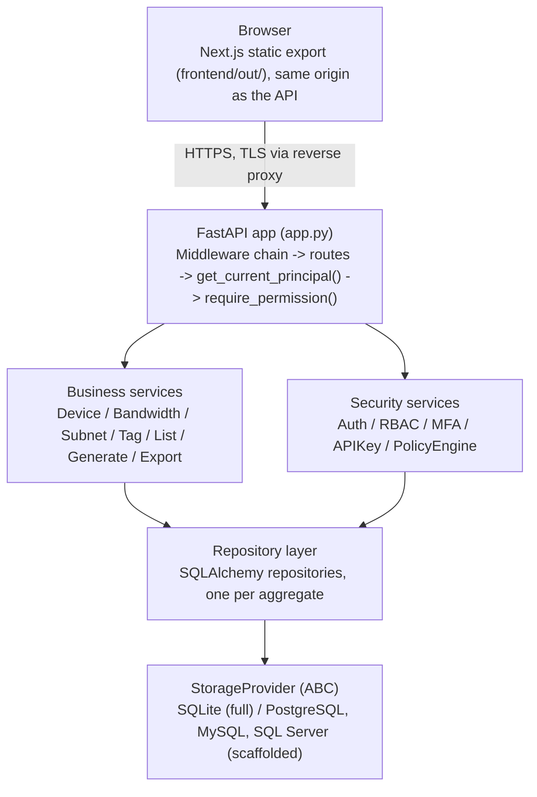

# Repository Overview

ConfigFoundry is a shared, self-hosted web application that generates SNMP/ICMP collector configuration YAML from a team-maintained inventory of network devices, bandwidth caps, and subnets. It replaces the common pattern of a hand-maintained spreadsheet plus hand-rolled monitoring config with one shared web server, a REST API, enterprise-grade authentication/RBAC, and a fully air-gap-capable deployment path.

Status: **v0.5.0, "Enterprise Preview"** — see [Roadmap Overview](../roadmap/Roadmap Overview.md) and [Changelog](../../CHANGELOG.md).

## Purpose

Network operations teams need an always-current, single source of truth for "what devices exist, on what subnets, with what bandwidth caps" that can be turned into monitoring collector configuration on demand. ConfigFoundry is that source of truth: a small always-on service the whole team points a browser at, instead of everyone keeping their own spreadsheet copy.

## Vision

Per [Roadmap Overview](../roadmap/Roadmap Overview.md) and `docs/roadmap.md`, the project is working toward a v1.0 defined by a stable API, a stable schema (migrations only), a proven installer/upgrade path, real production usage, and community feedback from a beta cycle — not a fixed calendar date. Enterprise capabilities (SSO/LDAP, SQL Server, teams, multi-tenant inventory, time-based access policies) are explicitly planned for v0.7.0, and scalability (HA, plugin interface, performance) for v0.8.x. See [Product Vision](../internal/product/Product Vision.md) for the product-level framing of the same trajectory.

## Business problem solved

- **Spreadsheet sprawl** — multiple people editing their own copy of an inventory spreadsheet, with no way to know which copy is current.
- **Manual, error-prone config generation** — collector YAML hand-copied from spreadsheet data drifts from reality.
- **No audit trail** — spreadsheets don't record who changed what, or when.
- **Regulated-environment deployment** — many of the target environments (banks, government, defense, healthcare, telecom) cannot reach the public internet at all; most tooling silently assumes CDN/PyPI/npm reachability. ConfigFoundry is built air-gap-first rather than retrofitted for it. See [Air-Gap Deployment](../deployment/Air-Gap Deployment.md).

What ConfigFoundry deliberately is **not**: a CMDB (it tracks only the fields needed to generate monitoring config, not asset lifecycle/ownership/warranty), and it is not (yet) a multi-tenant inventory system — see [Features § What this deliberately isn't](features/Feature - Inventory Management.md#what-this-deliberately-isnt).

## High-level architecture

Full detail: [Architecture Overview](../architecture/Architecture Overview.md).

## Technologies used

**Backend:** Python 3.10+, FastAPI 0.139, SQLAlchemy 2.x, Alembic (migrations), Pydantic v2, uvicorn, Argon2id (`argon2-cffi`) for password hashing, PyJWT, PyOTP (TOTP/MFA), `cryptography` (AES-256-GCM at-rest encryption), `ddtrace` (Datadog APM auto-instrumentation).

**Frontend:** Next.js 14 (App Router, static export / `output: 'export'`), React 18, MUI 5 (Material UI, "Vuexy" theme), TanStack React Query, ApexCharts, TypeScript 5.9, `xlsx` (client-side Excel handling).

**Database:** SQLite by default (zero configuration); PostgreSQL, MySQL, SQL Server scaffolded behind a `StorageProvider` abstraction — see [Database Overview](../architecture/Database Overview.md).

**Legacy frontend:** a vanilla-JS static UI (`static/`) predating both the Next.js frontend and the auth layer; served only when `frontend/out/` doesn't exist. See [Feature - Network Tree](features/Feature - Network Tree.md) for the one capability still trapped there.

See [Backend Overview](../architecture/Backend Overview.md) and [Frontend Overview](../architecture/Frontend Overview.md) for details.

## Folder structure

| Folder | Purpose | Docs |
|---|---|---|
| `app.py` / `server.py` | FastAPI app factory / CLI entry point | [Architecture Overview](../architecture/Architecture Overview.md) |
| `api/`, `api/v1/` | REST routers (v1 live under `api/v1/`; loose files directly under `api/` are pre-versioning legacy) | [API Overview](../api/API Overview.md) |
| `core/` | Services, repositories, security, storage, logging, migrations, business logic | [Backend Overview](../architecture/Backend Overview.md) |
| `models/` | SQLAlchemy ORM models | [Database Overview](../architecture/Database Overview.md) |
| `schemas/` | Pydantic request/response schemas | [Backend Overview](../architecture/Backend Overview.md) |
| `alembic/` | Database migrations | [Database Overview](../architecture/Database Overview.md) |
| `frontend/` | Next.js source (`src/`) and static export (`out/`, generated) | [Frontend Overview](../architecture/Frontend Overview.md) |
| `static/` | Legacy vanilla-JS frontend + self-hosted Swagger/ReDoc assets | [Frontend Overview](../architecture/Frontend Overview.md) |
| `integrations/` | Placeholder + architectural contract for future external-system integrations | [Integrations Overview](../integrations/Integrations Overview.md) |
| `formats/` | Pure-Python YAML/XLSX serialization | [Backend Overview](../architecture/Backend Overview.md) |
| `tests/` | Pytest suite | [Testing Strategy](../development/Testing Strategy.md) |
| `scripts/` | Wheelhouse/npm-vendor builders, air-gap validator, release bundler | [Deployment Overview](../deployment/Deployment Overview.md) |
| `vendor/` | Vendored offline Python wheels (`python/`) and npm artifacts (`npm/`, not committed) | [Air-Gap Deployment](../deployment/Air-Gap Deployment.md) |
| `docs/` | Existing hand-written documentation (source for much of this vault) | — |
| `db/` | SQLite database file lives here at runtime | [Database Overview](../architecture/Database Overview.md) |
| `tools/` | `debug.py` — developer utility | [Backend Overview](../architecture/Backend Overview.md) |
| `theme/` | Vendored Vuexy theme reference templates (multiple framework variants), not part of the running app | [Code Quality Report](../development/Code Quality Report.md) |

## Entry points

- **`server.py`** — CLI entry point (`argparse`), calls `create_app()`, prints the "ConfigFoundry is running" banner, opens a browser tab.
- **`app.py::create_app()`** — FastAPI application factory: builds the `ServiceContainer`, registers middleware (in reverse-of-execution order — see [Architecture Overview](../architecture/Architecture Overview.md#request-lifecycle)), mounts `/api/v1/*`, self-hosted `/docs` and `/redoc`, and the static frontend at `/`.
- **`frontend/src/app/`** — Next.js App Router entry (route = folder); `(app)/` is the authenticated shell, `(auth)/login` is public, `documentation/` is the in-app docs viewer.

## Important configuration files

| File | Purpose |
|---|---|
| `.env` | Local dev environment values — Datadog APM config (`DD_*`), `DATABASE_URL`, `SECRET_KEY`, `NEXT_PUBLIC_*` frontend vars |
| `requirements.txt` / `requirements-dev.txt` | Pinned backend dependencies (no version ranges — see [Air-Gap Deployment](../deployment/Air-Gap Deployment.md)) |
| `frontend/package.json` | Frontend dependencies + scripts; also the single source of truth for the project's semantic version |
| `alembic.ini` / `alembic/env.py` | Migration configuration |
| `Makefile` | Developer convenience targets (`make dev`, `make build`, `make test`, ...) — see [Engineering Wiki](../development/Engineering Wiki.md) |
| `.github/workflows/ci.yml` | CI: repo hygiene, backend tests, frontend typecheck/lint, air-gap validation, offline-install smoke test, release bundle build |
| A YAML file passed via `--config` | Full `AppConfig` (database, logging, security) — see [Storage Abstraction](../architecture/Storage Abstraction.md) |

Every setting can also be supplied as a `CONFIGFOUNDRY_*` environment variable, which takes priority over the YAML file — see [Secrets & Configuration](../security/Secrets & Configuration.md).

## Build process

- **Backend:** no build step — `pip install -r requirements.txt` then `python3 server.py`.
- **Frontend:** `cd frontend && npm install && npm run build` produces the static export at `frontend/out/`, which FastAPI serves directly via `StaticFiles`. `make build` wraps this with a self-healing retry for a known Next.js SWC/lockfile bug.
- **Offline/release bundle:** `scripts/build_release_bundle.sh` assembles a self-contained `ConfigFoundry-Offline-vX.Y.Z.zip` with a prebuilt frontend and vendored Python/npm dependencies. See [Deployment Overview](../deployment/Deployment Overview.md).

## Runtime flow

1. `server.py` parses CLI args, calls `create_app()`.
2. `ServiceContainer` builds a `StorageProvider` (SQLite by default), calls `initialize()`, which runs Alembic migrations automatically.
3. FastAPI registers middleware, mounts the `/api/v1` router, then mounts the static frontend (`frontend/out/` if present, else `static/`) — static mount **must** be last, or it shadows the API routes.
4. A request flows through `SecurityHeadersMiddleware → TrustedProxyMiddleware → AccessPolicyMiddleware → RateLimitMiddleware → CORS → CorrelationID → RequestLogging → route handler → service → repository → StorageProvider`.
5. Security-sensitive and business-mutating actions are recorded via `AuditRepository.log(...)`.

Full detail: [Architecture Overview](../architecture/Architecture Overview.md#request-lifecycle).

## External dependencies

- **None required at runtime** for the default (SQLite) deployment — this is a deliberate architecture principle, verified automatically by `scripts/validate_airgap.py` and a CI job that firewalls the runner off from PyPI/npm/GitHub before proving an offline install still works. See [Air-Gap Deployment](../deployment/Air-Gap Deployment.md).
- **Optional:** PostgreSQL/MySQL/SQL Server if a non-SQLite storage provider is configured (drivers not vendored by default).
- **Datadog** — APM tracing/profiling/log-injection via `ddtrace` (backend) and `dd-trace` (frontend), enabled only when `DD_*` environment variables are set. See [Datadog APM](../integrations/Datadog APM.md).

## See also

[Architecture Overview](../architecture/Architecture Overview.md) · [Executive Summary](../internal/product/Executive Summary.md) · [Product Vision](../internal/product/Product Vision.md) · [Engineering Wiki](../development/Engineering Wiki.md)
